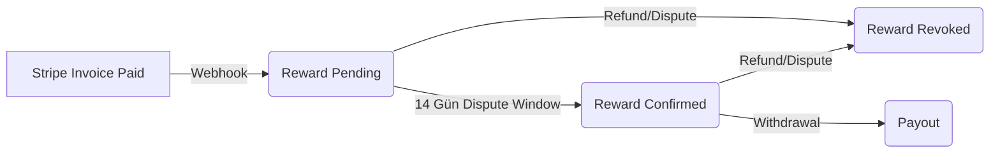

# Financial Architecture v2 (P16)

**Vizyon:** Stripe olaylarına tam senkronize çalışan, immutable (değiştirilemez) ledger tabanlı finansal motor.

## 1. Reward Lifecycle

## 2. Ledger Flow (Çift Taraflı Kayıt)
Her finansal olay Ledger'da bir satır oluşturur:
*   **CREDIT:** `Maturity` (Confirmed Reward) -> Balance Artar.
*   **DEBIT:** `Revocation` (Refund/Dispute) -> Balance Azalır.
*   **PAYOUT:** `Withdrawal` -> Balance Azalır.

**Formül:** `Net Balance = SUM(CREDIT) - SUM(DEBIT) - SUM(PAYOUT)`

## 3. Kontrol Katmanları
1.  **Stripe Layer:** Ödeme alma ve iade yönetimi (Source of Truth for Money).
2.  **Ledger Layer:** İç muhasebe ve hak ediş takibi (Source of Truth for Balance).
3.  **Policy Layer:** Withdraw yetkisi, negatif bakiye kontrolü (`LedgerService`).

## 4. Monitoring
*   **Daily Recon Job:** Stripe Balance vs Ledger Balance.
*   **Alerts:** `revoked_count` spike, `negative_balance_user` > 0.
