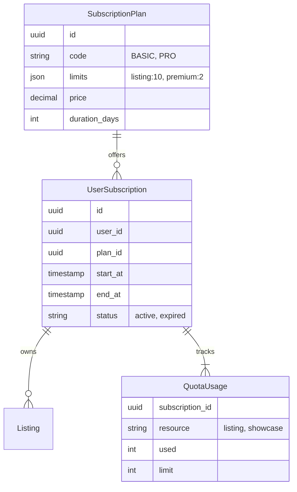

# P10 Domain Model

**Document ID:** P10_DOMAIN_MODEL_v1  
**Date:** 2026-02-13  
**Status:** 🏗️ ARCHITECTURE  

---

## 1. Entity Relationship Diagram (ERD)

## 2. Table Specifications

### 2.1. `subscription_plans`
Defines what is for sale.
- `id`: UUID
- `code`: String (Unique, e.g., `DEALER_TR_PRO`)
- `name`: JSON (i18n)
- `price`: Numeric
- `currency`: String
- `limits`: JSON (Snapshot of what this plan offers)
- `is_public`: Boolean (Hidden custom plans)

### 2.2. `user_subscriptions`
The active contract between User and Platform.
- `id`: UUID
- `user_id`: UUID
- `plan_id`: UUID
- `status`: Enum (active, cancelled, past_due)
- `current_period_start`: Timestamp
- `current_period_end`: Timestamp
- `payment_method_id`: String (Reference to payment provider)

### 2.3. `listing_quota_usage` (Optimization)
Instead of counting active listings every time (expensive), we track usage.
- `user_id`: UUID
- `subscription_id`: UUID
- `active_listing_count`: Integer
- `showcase_usage_count`: Integer

*Note: This table must be kept in sync with actual listings via DB Triggers or Transactional Application Logic.*

---

## 3. Pricing Rules (Ad-hoc)
Table: `pricing_rules`
- `context`: JSON (Match criteria: country, user_role)
- `item_type`: String (Listing, Bump, Showcase)
- `price`: Numeric
