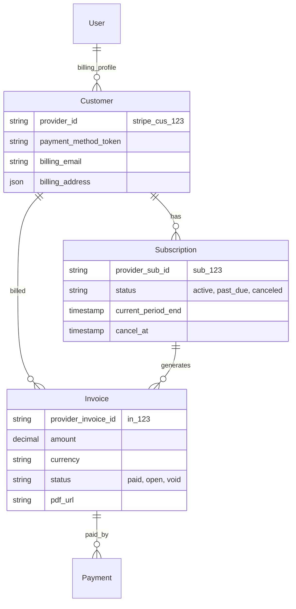

# P11 Billing Domain Model

**Document ID:** P11_BILLING_DOMAIN_MODEL_v1  
**Date:** 2026-02-13  
**Status:** 🏗️ ARCHITECTURE  

---

## 1. Entity Relationship

## 2. Table Specifications (Additions)

### 2.1. `customers` (New)
Maps internal `User` to Payment Provider's Customer.
- `user_id`: PK/FK
- `provider_id`: Unique Index
- `balance`: Numeric (Credits/Debits)

### 2.2. `payments` (New)
Audit trail of transactions.
- `id`: UUID
- `invoice_id`: FK
- `amount`: Numeric
- `provider_tx_id`: String
- `status`: String (succeeded, failed)
- `created_at`: Timestamp

### 2.3. `user_subscriptions` (Update)
Enhance existing table from P10.
- Add `provider_subscription_id`: String (Index)
- Add `cancel_at_period_end`: Boolean

---

## 3. State Machine (Subscription)
1. **Incomplete:** Checkout started.
2. **Active:** Payment succeeded. -> **Quota Unlocked.**
3. **Past Due:** Renewal failed. -> **Quota Grace Period (3 days).**
4. **Canceled:** User stopped auto-renew. -> **Active until Period End.**
5. **Unpaid/Expired:** Final state. -> **Quota Reset to Free.**
